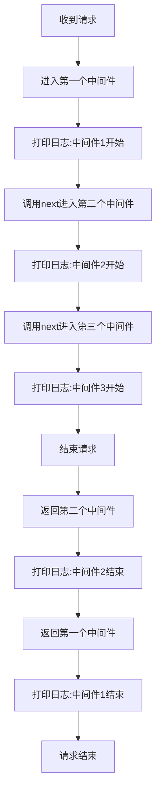

## 实现基于 Node 的入门 HTTP 服务

```js
const http = require("http");
const fs = require("fs");
const server = http.createServer((req, res) => {
  res.writeHead(200);
  res.end("hello, koa！");
});
server.listen(3000, () => {
  console.log("sever at 3000");
});
```

## 创建 miniKoa 类，实现 use 和 listen 方法

在 miniKoa 类中，use 方法用来处理中间件，listen 方法用来监听端口

miniKoa.js

```js
// 引入原生 http 模块
const http = require("http");

// 声明 MiniKoa 类
class MiniKoa {
  // 实现 listen 方法
  listen(...args) {
    // 调用原生 http.createServer 创建服务
    const server = http.createServer((req, res) => {
      // 调用 callback 实现业务代码
      this.callback(req, res);
    });
    // 调用原生 server.listen 监听端口
    server.listen(...args);
  }
  // 实现 use 方法
  use(callback) {
    // 真正的业务逻辑代码通过 use 方法保存到 this.callback 中。
    this.callback = callback;
  }
}

module.exports = MiniKoa;
```

```js

// 引入 MiniKoa
const MiniKoa = require('./mini_koa')

// 创建 MiniKoa 实例
const app = new MiniKoa()

调用 use 方法
app.use((req, res) => {
  res.writeHead(200)
  res.end("hello, MiniKoa!")
})

// 调用 listen 方法
app.listen(3000, () => {
  console.log('sever at 3000');
})

```

## 构建上下文

koa 为了能够简化 API，引⼊上下⽂ context 概念，将原始请求对象 req 和响应对象 res 封装并挂载到 context 上，并且在 context 上设置 getter 和 setter，从⽽简化操作。

- 请求对象 request

```javascript
// request.js
module.exports = {
  get url() {
    return this.req.url;
  },

  get method() {
    return this.req.method.toLowerCase();
  },
};
```

- 响应对象 response

```javascript
// response.js
module.exports = {
  get body() {
    return this._body;
  },
  set body(val) {
    this._body = val;
  },
};
```

- 上下文 context

```javascript
// context.js
module.exports = {
  get url() {
    return this.request.url;
  },
  get body() {
    return this.response.body;
  },
  set body(val) {
    this.response.body = val;
  },
  get method() {
    return this.request.method;
  },
};
```

```javascript

// MiniKoa.js
const http = require("http")
+ const context = require("./context");
+ const request = require("./request");
+ const response = require("./response");
class MiniKoa {
  listen(...args) {
    const server = http.createServer((req, res) => {
      // 创建上下⽂
+     let ctx = this.createContext(req, res);
      this.callback(ctx)
      // 响应
+     res.end(ctx.body);
    })
    server.listen(...args)
  }
  use(callback) {
    this.callback = callback
  }
  // 构建上下⽂, 把res和req都挂载到ctx之上，并且在ctx.req和ctx.request.req同时保存
+  createContext(req, res) {
+    const ctx = Object.create(context);
+    ctx.request = Object.create(request);
+    ctx.response = Object.create(response);
+    ctx.req = ctx.request.req = req;
+    ctx.res = ctx.response.res = res;
+    return ctx;
+  }
}

module.exports = MiniKoa
```

- 然后就可以像 koa 一样去使用上下文
  - 当访问 ctx.url 的时候，实际上就是在访问 ctx.request.req.url
  - 同理，当我们访问 ctx.body 的时候，就是在访问 ctx.response.body

## 洋葱模型与中间件机制

Koa 中间件机制就是函数式组合概念 Compose 的概念，洋葱圈模型可以形象表示这种机制。

### 洋葱模型
Koa的洋葱圈模型主要是受函数式编程中的compose思想启发而来的。Compose函数可以将需要顺序执行的多个函数复合起来，后一个函数将前一个函数的执行结果作为参数。这种函数嵌套是一种函数式编程模式。

- 先测试Koa的洋葱模型

```javascript
const Koa = require('koa');
const app = new Koa();

app.use(async (ctx, next) => {
  console.log('中间件1开始');
  
  await next();
  
  console.log('中间件1结束');
});

app.use(async (ctx, next) => {
  console.log('中间件2');

  await next();

  console.log('中间件2结束');  
});

app.use(async ctx => {
  console.log('中间件3')
});

app.listen(3000);
```

- 输出结果
```
中间件1开始
中间件2
中间件3
中间件2结束
中间件1结束
```
分析：
执行流程


### 实现中间件机制

```javascript
// MiniKoa.js
class MiniKoa {
+  constructor() {
+    //  设置数组用来存放中间件
+    this.middleWares = []
+  }

  listen(...args) {
    // 创建原生服务
    const server = http.createServer(async (req, res) => {
      // 创建上下⽂
      let ctx = this.createContext(req, res);
      // 合成函数，形成洋葱圈
+      const fn = this.compose(this.middleWares)
+      await fn(ctx)
      // 响应
      res.end(ctx.body);
    })
    server.listen(...args)
  }

  use(middleWare) {
    // 把中间件函数存起来
-    this.callback = callback
+    this.middleWares.push(middleWare)
  }

  // 构建上下⽂, 把res和req都挂载到ctx之上，并且在ctx.req和ctx.request.req同时保存
  createContext(req, res) {
    const ctx = Object.create(context);
    ctx.request = Object.create(request);
    ctx.response = Object.create(response);
    ctx.req = ctx.request.req = req;
    ctx.res = ctx.response.res = res;
    return ctx;
  }

  // 合成函数
+  compose(middleWares) {
+    return function(ctx) {
+      return dispatch(0)
+      function dispatch(i) {
+        let fn = middleWares[i]
+        if (!fn) {
+          return Promise.resolve()
+        }
+        return Promise.resolve(
+          // 在这里传入上下文 ctx
+          fn(ctx, function next() {
+           return dispatch(i + 1)
+          })
+        )
+      }
+    }
+  }
}
```

测试一下中间件和洋葱模型

```javascript
// index.js
const MiniKoa = require('./MiniKoa')

// 创建 MiniKoa 实例 
const app = new MiniKoa()

// 模拟异步操作
const delay = () => new Promise(resolve => setTimeout(() => resolve(), 2000));

app.use(async (ctx, next) => {
  ctx.body = "1";
  await next();
  ctx.body += "5";
});
app.use(async (ctx, next) => {
  ctx.body += "2";
  await delay();
  await next();
  ctx.body += "4";
});
app.use(async (ctx, next) => {
  ctx.body += "3";
});

app.listen(3000, () => {
  console.log('sever at 3000');
})
```

输出结果：
```
12345
```

## 基于中间件实现路由访问

```javascript
// router.js
class MiniRouter {
  constructor() {
    // 策略库
    this.stack = []
  }

  /**
   * 注册策略到策略库中
   * @param {*} path 请求路径
   * @param {*} method 请求方法
   * @param {*} middleWare 中间件
   */
  register(path, method, middleWare) {
    let route = { path, method, middleWare }
    this.stack.push(route)
  }

  // 注册 get 请求
  get(path, middleWare) {
    this.register(path, 'get', middleWare)
  }

  // 注册 post 请求
  post(path, middleWare) {
    this.register(path, 'post', middleWare)
  }

  // 路由中间件
  routes() {
    let _stack = this.stack
    // 返回的是一个中间件
    return async function(ctx, next) {
      // 获取到上下文中的 url
      let currentPath = ctx.url
      // 声明一个策略
      let route
      // 根据上下文中的 method 查找对应的策略
      for (let i = 0; i < _stack.length; i++) {
        const item = _stack[i];
        if (currentPath === item.path &amp;&amp; item.method === ctx.method) {
          route = item.middleWare
          break
        }
      }
      // 如果取出的策略是一个函数,执行这个函数
      if (typeof route === 'function') {
        route(ctx, next)
        return
      }
      // 进入下一个中间件
      await next()
    }
  }
}

module.exports = MiniRouter
```